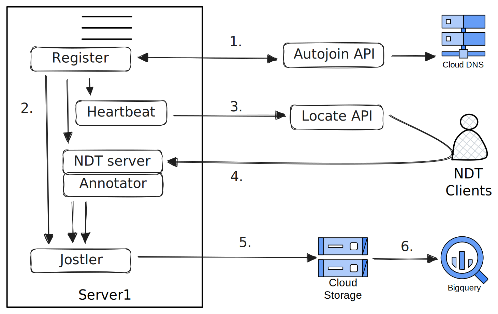

# autonode

| Autonode Register and Measure |
| ----------------------------- |
|  |

After a hosting organization registers with M-Lab, their autonodes will:

1. Register with the Autojoin API
2. Distribute credentials & metadata to local services
3. Report node health to the Locate API
4. Clients run NDT tests targeting this node
5. NDT measurements are archived
6. NDT measurements published to BigQuery
