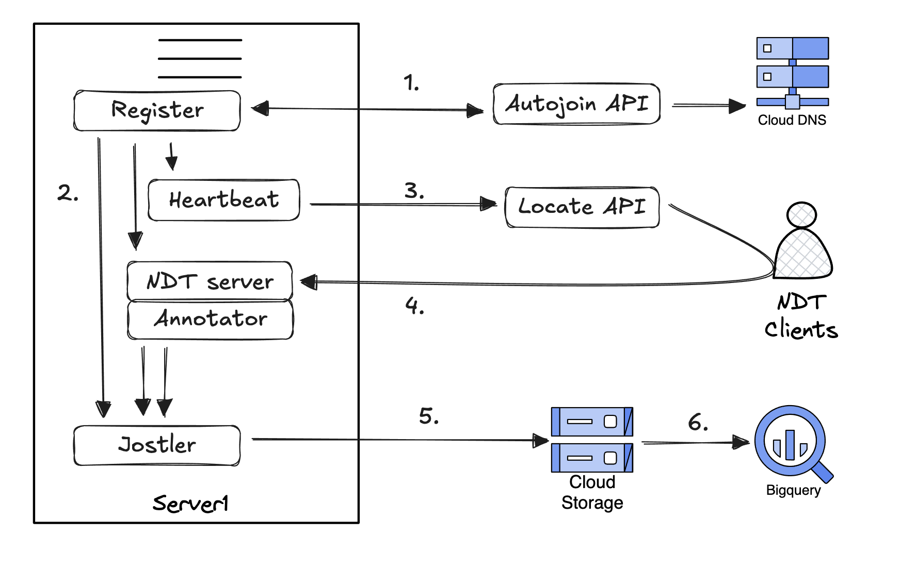

# autonode

| Autonode Register and Measure |
| ----------------------------- |
|  |

1. Register with Autojoin API
2. Distribute credentials & metadata
3. Report node health to Locate API
4. Clients run NDT tests
5. Measurements are archived
6. And, published to BigQuery
